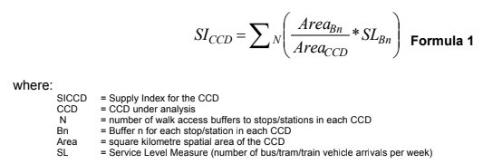
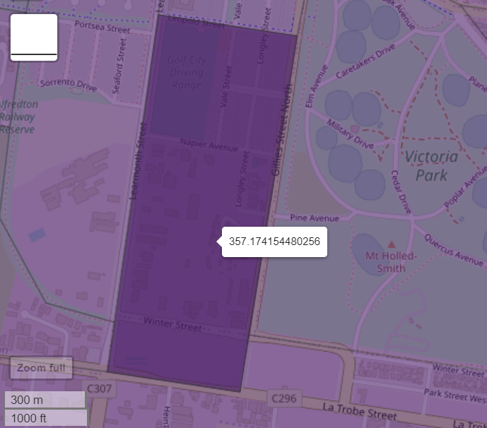

---
title: "DEAKIN housing and transit accessibilty"
runningheader: "DEAKIN housing and transit accessibilty" # only for pdf output
subtitle: "Census SA1 and GFTS-based analysis" # only for html output
author: "Dr James Reynolds"
date: "`r Sys.Date()`"
output:
  tufte::tufte_html: default
  tufte::tufte_handout:
    citation_package: natbib
    latex_engine: xelatex
  tufte::tufte_book:
    citation_package: natbib
    latex_engine: xelatex
bibliography: [Deakin.bib, packages.bib]
link-citations: no
---

```{r setup, include=FALSE}
library(tufte)
library(tidyverse)
library(dplyr)
library(tidytransit)
library(sp)
library(absmapsdata)
library(ptinpoly)
library(magrittr)
library(ggplot2)
library(sf)
library(ASGS.foyer)
library(raster)
library(ggmap)
library(units)
library(janitor)
library(mapview)
library(ggstatsplot)
library(gtsummary)
library(moments)
library(scales)
library(plyr)


# invalidate cache when the tufte version changes
knitr::opts_chunk$set(cache.extra = packageVersion('tufte'))
options(htmltools.dir.version = FALSE)
```


# 1.0 Introduction

Monash University's Public Transport Research Group (PTRG) is engaged in providing a measure of transit accessibility for Statistical Area Level 1 (SA1) areas across Greater Melbourne to researchers at Deakin University. Previous research [@currie2007identifying] developed a Supply Index for census districts to allow comparison of overall service provision. The Supply Index is based on the number of transit arrivals per week to stops within an area of interest, with an adjustment made to account for the amount of the area covered by each stop's catchment. @currie2007identifying calculated his Service Index for Census Collection Districts (CCDs) across Greater Melbourne, using timetable data from a database of bus, tram and train stations and routes provided by the public transport authority. 

The Supply Index and its calculation reported in @currie2007identifying pre-date the development of the General Transit Feed Specification (GTFS). GTFS is an open, text-based format for the provision of transit timetable data. It was developed originally to allow transit information to be included in the Google Maps navigation platform. More than 10,000 transit agencies now provide their timetable data in the GTFS format[@GTFS].

A question, therefore, is whether the Supply Index can be calculated directly from GTFS data. This document addresses this by using the statistical programming language R [@R-base], the tidytransit package [@tidytransit2023] and other tools to develop code to calculate the Supply Index. The GTFS files for Victoria, Australia [@Transport:2023aa], are used as test data and to meet the needs of researchers at Deakin University. 

The rest of this document is structured as follows: the next section discusses the research context of the Supply Index.  Section 3 describes the method for calculating the Supply Index using the Melbourne GTFS files and R. Section 4 presents results, followed by a brief discussion and conclusion in Section 5. 

# 2.0 Research context

The Supply Index^[] was developed in @currie2007identifying.  It represents the amount of transit supplied, adjusted for accessibility, for an area of interest. The Index is based on the number of bus/tram/train arrivals per week at stops within the area of interest, which is multiplied by a factor allowing for the amount of the area of interest that is within walking distance of each stop^[This is the Area~Bn~ divided by Area~CCD~ part of the calculation. Thresholds for access of 400m for bus and tram stops, and 800m for railway stations are used in the calculation of the Area~Bn~ variable.]. 

@currie2007identifying calculated the Supply Index for each Census Collection District (CCD)^[CCDs predate the current SA1, SA2 etc. geographical areas now used by the Australian Bureau of Statistics (ABS).] across Greater Melbourne (the SI~CCD~).  Calculations were based on timetable data provided by the Victorian Public Transport Authority (PTA). This predated the widespread availability of GTFS data, which provides a standardised format for timetable data, which has been adopted by many transit systems. A question, therefore, is how to calculate the Service Index using GTFS data so that Supply Index values can be calculated for current services in Melbourne or other places. 

# 3.0 Methods

Here the R programming language [@R-base] is used to calculate Service Index scores from a GTFS feed and shape files^[The shape files defining the areas of interest.]. In this document the GTFS files for Victoria are used as the transit schedule. The tidytransit R package [@tidytransit2023] was used for processing the GTFS files^[See https://r-transit.github.io/tidytransit/articles/introduction.html for description.]. The 2021 Statistical Area Level 1 (SA1) shape files from the @SA1_2021 (ABS) were adopted as the areas of interest. The absmapsdata package [@absmapsdata]^[See https://github.com/wfmackey/absmapsdata] was used to obtain the SA1 shape files.

The processes involved in calculating the components of the Supply Index^[In turn being: the Service Level Measure (SL~Bn~), the Area~Bn~ and the Area~SA1~ variables.] are described in the following sections.


## 3.1 Service Level Measure (SL~Bn~)

@tidytransit_departure_timetable describes how to generate a departure timetable for an individual stop from a GTFS file using the tidytransit R package.  This code was adjusted to perform a similar calculation, but for arrivals rather than departures, and for a period of one week rather than one day.  

```{r load_melbourne_data, echo=FALSE}
##Commented out when reading mel1_SICCD.csv, mel2_SICCD.csv etc, as the calculations have already been done so there is no need to load the GTFS files. 
#mel1 <- read_gtfs("data/1google_transit.zip")
#mel2 <- read_gtfs("data/2google_transit.zip")
#mel3 <- read_gtfs("data/3google_transit.zip")
#mel4 <- read_gtfs("data/4google_transit.zip")
#mel5 <- read_gtfs("data/5google_transit.zip")
#mel6 <- read_gtfs("data/6google_transit.zip")
#mel7 <- read_gtfs("data/7google_transit.zip")
#mel8 <- read_gtfs("data/8google_transit.zip")
#mel10 <- read_gtfs("data/10google_transit.zip")
#mel11 <- read_gtfs("data/11google_transit.zip")

#summary(mel1)

```


```{r arrival_timetable_as_a_function, echo=FALSE, fig.fullwidth=TRUE, fig.cap="Melbourne, Southern Cross arrival timetable for April 27, 2023", cache=TRUE}

#This was code was developed based on the tidytransit vignette on producing a departure timetable. See the back history on GitHub for further details, but basically I wrote a departure_timetable_function, fixed up a bit where it wasn't accounting for through-running services.  This was then directly adjusted to create an arrival_timetable function (below) --- However, I didn't get chance to adjust all the variable names in the function to reflect that it is about arrivals, not departures.  
arrival_timetable_function <- function(gtfs, stop_to_show, date_to_show){
  # get the id of the first stop in the trip's stop sequence
  first_stop_id <- gtfs$stop_times %>% 
    group_by(trip_id) %>% 
    summarise(stop_id = stop_id[which.min(stop_sequence)])

  # join with the stops table to get the stop_name
  first_stop_names <- left_join(first_stop_id, gtfs$stops, by="stop_id")

  # rename the first stop_name as trip_origin
  trip_origins <- first_stop_names %>% dplyr::select(trip_id, trip_origin = stop_name)

  # join the trip origins back onto the trips
  gtfs$trips <- left_join(gtfs$trips, trip_origins, by = "trip_id")

  
  #### get the id of the last stop in the trip's stop sequence
  last_stop_id <- gtfs$stop_times %>% 
    group_by(trip_id) %>% 
    summarise(stop_id = stop_id[which.max(stop_sequence)])

  # join with the stops table to get the stop_name
  last_stop_names <- left_join(last_stop_id, gtfs$stops, by="stop_id")

  # rename the last stop_name as trip_destination
  trip_destinations <- last_stop_names %>% dplyr::select(trip_id, trip_destination = stop_name)

  # join the trip destinations back onto the trips
  gtfs$trips <- left_join(gtfs$trips, trip_destinations, by = "trip_id")

  
  #gtfs$trips %>%
  #  dplyr::select(route_id, trip_origin) %>%
  #  head()

  if(!exists("trip_headsign", where = gtfs$trips)) {
    # get the last id of the trip's stop sequence
    trip_headsigns <- gtfs$stop_times %>% 
      group_by(trip_id) %>% 
      summarise(stop_id = stop_id[which.max(stop_sequence)]) %>% 
      left_join(gtfs$stops, by="stop_id") %>% dplyr::select(trip_id, trip_headsign.computed = stop_name)

  #create a new field with 
  trip_destination <- gtfs$stop_times %>% 
      group_by(trip_id) %>% 
      summarise(stop_id = stop_id[which.max(stop_sequence)]) %>% 
      left_join(gtfs$stops, by="stop_id") %>% dplyr::select(trip_id, trip_headsign.computed = stop_name)

    
    
    # assign the headsign to the gtfs object 
    gtfs$trips <- left_join(gtfs$trips, trip_headsigns, by = "trip_id")
  }

  stop_ids <- gtfs$stops %>% 
    filter(stop_name == stop_to_show) %>% 
    dplyr::select(stop_id)

  departures <- stop_ids %>% 
    inner_join(gtfs$stop_times %>% 
                 dplyr::select(trip_id, arrival_time, 
                        departure_time, stop_id), 
               by = "stop_id")
  
  departures <- departures %>% 
    left_join(gtfs$trips %>% 
                dplyr::select(trip_id, route_id, 
                       service_id, trip_headsign, 
                       trip_origin, 
                       trip_destination), 
              by = "trip_id") 
  
  departures <- departures %>% 
    left_join(gtfs$routes %>% 
                dplyr::select(route_id, 
                       route_short_name), 
              by = "route_id")

  #remove trips where first stop is equal to the stop_to_show, as these stops originate at this stop and so do not depart
  departures <- departures %>% 
      filter(trip_origin != stop_to_show)
  
  
  #departures %>% 
  #  dplyr::select(arrival_time,
  #         departure_time,
  #         trip_headsign,trip_origin,
  #         route_id) %>%
  #  head() %>%
  #  knitr::kable()

  #head(gtfs$.$dates_services)


  services_on_180823 <- gtfs$.$dates_services %>% 
    filter(date == date_to_show) %>% dplyr::select(service_id)

  departures_180823 <- departures %>% 
    inner_join(services_on_180823, by = "service_id")

#  departures_180823 %>%
 #   arrange(departure_time, stop_id, route_short_name) %>% 
  #  dplyr::select(departure_time, stop_id, route_short_name, trip_headsign) %>% 
   # filter(departure_time >= hms::hms(hours = 7)) %>% 
   # filter(departure_time < hms::hms(hours = 7, minutes = 10)) %>% 
  #  knitr::kable()

  route_colors <- gtfs$routes %>% dplyr::select(route_id, route_short_name, route_color)
  route_colors$route_color[which(route_colors$route_color == "")] <- "454545"
  route_colors <- setNames(paste0("#", route_colors$route_color), route_colors$route_short_name)

  #No need for list of outputs anymore, as the graphs are no longer needed
  #output <- list(
   #   ggplot(departures_180823) + theme_bw() +
    #  geom_point(aes(y=trip_origin, x=arrival_time, color = route_short_name), size = 0.2) +
     # scale_x_time(breaks = seq(0, max(as.numeric(departures$departure_time)), 3600), 
      #             labels = scales::time_format("%H:%M")) +
      #theme(axis.text.x = element_text(angle = 90, hjust = 1)) +
      #theme(legend.position = "bottom") +
      #scale_color_manual(values = route_colors) 
  #    labs(title = paste("Departures from", stop_to_show, "on", date_to_show))
  #add a return value to provide the number of services shown in the graph as an output
       #   , nrow(departures_180823)
    #  )
  #return list with graph and the number of services. 
  return(departures_180823)
  
}
#arrivals_southern_cross_230427 <- arrival_timetable_function(gtfs=mel1, stop_to_show="Southern Cross Railway Station (Melbourne City)", date_to_show="2023-04-27")
#head(arrivals_southern_cross_230427)
```


```{r arrival_timetable_7_day, echo=FALSE, fig.fullwidth=TRUE, fig.cap="Swan Hill arrival timetable for week of April 27, 2023"}

arrival_seven_day_function <- function(gtfs, stop_to_show, first_date){
  day1 <- arrival_timetable_function(gtfs=gtfs, stop_to_show=stop_to_show, date_to_show=first_date)
  day2 <- arrival_timetable_function(gtfs=gtfs, stop_to_show=stop_to_show, date_to_show=(as.Date(first_date) + 1))
  day3 <- arrival_timetable_function(gtfs=gtfs, stop_to_show=stop_to_show, date_to_show=(as.Date(first_date) + 2))
  day4 <- arrival_timetable_function(gtfs=gtfs, stop_to_show=stop_to_show, date_to_show=(as.Date(first_date) + 3))
  day5 <- arrival_timetable_function(gtfs=gtfs, stop_to_show=stop_to_show, date_to_show=(as.Date(first_date) + 4))
  day6 <- arrival_timetable_function(gtfs=gtfs, stop_to_show=stop_to_show, date_to_show=(as.Date(first_date) + 5))
  day7 <- arrival_timetable_function(gtfs=gtfs, stop_to_show=stop_to_show, date_to_show=(as.Date(first_date) + 6))
  
  week <- list(day1, day2, day3, day4, day5, day6, day7)
  
  return(week)

  }
  
```

## 3.2 Area~Bn~ variable 

The Area~Bn~ variable is based on a 400 metre radius catchment area / buffer zone for bus and tram stops, and an 800 metre radius for railway stations. The Victorian GTFS being used here is already split into individual GTFS files for each mode, which made deciding which radius to use for each stop relatively trivial^[If the code is to be generalised to deal with other GTFS datasets there may be a need to handle situations where there are a mix of bus/tram and trains using a single stop. However, 'mode' is not a variable in the part of the GTFS data that describes stops (stops.txt), but is instead defined in the 'route' file (routes.txt)[@GTFS_schedule_reference]. A potential solution may be to split each GTFS by mode at the outset, but for the purposes of this document that is left for future research.].   

A complicating factor, however, is identifying how much of each area associated with each stop is within which each spatial zone. Stops that are well within the boundaries of a spatial zone will have all of their catchment area within the spatial zone.  However, where a transit stop is located close to a boundary it may be that part of the catchment area is in one spatial zone while another part is in a different zone.  The Area~Bn~ variable calculation therefore needs to account for locations where the catchment area of a stop overlays a spatial zone boundary.  

The sp package from [@spatial_data_in_R, @applied_spatial_data_analysis_with_R] provides tools for manipulating geographic data and shape files in R. This was used to calculate the proportion of each stop's catchment area that falls into each geographical area of interest. 

GTFS files define stop locations based on latitude and longitude [@GTFS_schedule_reference], whereas the Area~Bn~ calculation needs to be provided in the same units as the Area~CCD~ variable. In this case this was achieved using the EPSG:28355 transform [@EPSG_28355] to project the stop locations onto the Geocentric Datum of Australia 1994 (GDA95 / MGA zone 55) coordinates. All distance-based calculations were undertaken in metres so as to match the map projection. 

```{r load_abs_data, messages = FALSE, warnings = FALSE, echo=FALSE, fig.fullwidth=TRUE, fig.cap="Melbourne SA1 map"}
#Load SA1 data
sa1_map_data <- sa12021

##Map Greater Melbourne SA1 areas
#map <- sa1_map_data %>%
#  filter(gcc_name_2021 == "Greater Melbourne") %>%   # let's just look Melbourne
#  ggplot() +
#  geom_sf(aes(geometry = geometry,  # use the geometry variable
#              fill = areasqkm_2021),     # fill by area size
#          lwd = 0,                  # remove borders
#          show.legend = TRUE) +    # keep legend
# # geom_point(aes(cent_long,
#  #               cent_lat),        # use the centroid long (x) and lats (y)
#   #          colour = "white") +    # make the points white
#  theme_void() +                    # clears other plot elements
#  coord_sf()

#map
```


## 3.3 Area~SA1~ variable
The Area~SA1~ variable is the spatial area of the area under consideration^[Previously this was the Area~CCD~ variable when CCDs were used.]. In the case of SA1 areas being used for this test case the land area in square kilometres is provided as a field in the ABS dataset of shape files, and so this just needs to be converted into square metres^[To match the units (metres) used in the map projection of ABS shape files and the units used for the buffer zone distance variable. Developing a generalised solution to calculate the spatial area variable directly from input shape files may be an avenue for future research. ]. 

## 3.4 Putting the SI~SA1~ together
The overall SI~SA1~ calculation was performed as follows: 
 
- calculation of the Service Level Measure (SL~Bn~) for a single stop, 
- calculation of the amount of the catchment area (Area~Bn~) that falls into each (SA1) geographical area^[For most geographical areas this will be zero. Where the catchment area of the single stop in question is fully within a geographical area that geographical area will receive 100% of the buffer zone area. It is only where a stop is close to a geographical zone boundary where there will be areas allocated to multiple geographical areas.],
- calculation of the contribution to the SI~SA1~ made by just that single stop for every (SA1) geographical area; 
- addition of the calculated SI~SA1~ for the single stop to a cumulative total field for each SA1 area; and 
- repetition until all stops in the GTFS file have been included. 

For the purposes of this case study the SI~SA1~ was calculated for the seven days starting Thursday April 27, 2023. This was shortly after the end of the school holidays (April 7th to 23rd) and ANZAC Day (April 25)^[Recalculation for a different date should be relatively trivial, although the it takes about four days to complete the calculation on a single computer. Improving the algorithm's efficiency may be a direction for future research, although this seems somewhat unnecessary as SI~SA1~ values do not appear likely to ever be needed in real-time or a hurry.]. 


```{r SICCD_calc_as_functions, echo=FALSE, warning=FALSE, message=FALSE, fig.margin=FALSE, fig.cap="SI for week starting 27/04/23 for Melbourne Metro trains, Melbourne City area"}

#Next step will be to generalise the code into a function that will calculate the SI~SA1~ for all SA1 districts, for any starting date, and using all of the relevant GTFS files for Victoria^[Not just the regional trains.].

#buffer_distance <- 800
#gtfs <- mel1
#start_date <- "2023-04-27"
#EPSG_for_transform <- 28355


sa1_map_data_victoria <- sa1_map_data %>%
  filter(state_name_2021 == "Victoria") # let's just look at Victoria

SICCD_calc_function <- function(sa1_map_data = sa1_map_data, gtfs = gtfs, start_date = start_date, EPSG_for_transform = EPSG_for_transform, buffer_distance = buffer_distance){

  # convert to sf format
  dat_abs_sf <- sa1_map_data %>%
    # convert to simple features
    sf::st_as_sf() %>%
      st_transform(EPSG_for_transform) # Reproject to EPSG:28355 as mentioned above

  # Create SICCD variable for the running total.  Set units to square km for ease of calculation
  dat_abs_sf$SI_CCD <- set_units(0, "m^2")

  for (i in seq(1,nrow(gtfs$stops),1)) {
    #SI_CCD variable back to units of m^2
    dat_abs_sf$SI_CCD <- set_units(dat_abs_sf$SI_CCD, "m^2")
  
    dat_sim <- data.frame(lat = gtfs$stops$stop_lat[i],
                        long = gtfs$stops$stop_lon[i])

    # Convert to sf, set the crs to EPSG:4326 (lat/long), 
    # and transform to EPSG:28355 - as per https://epsg.io/28355
    dat_sf <- st_as_sf(dat_sim, coords = c("long", "lat"), crs = 4326) %>% 
    st_transform(EPSG_for_transform)

   # Buffer circles by the buffer distance
    dat_circles <- st_buffer(dat_sf, dist = buffer_distance)

    # Intersect the circles with the polygons
    int_circles <- st_intersection(dat_abs_sf, dat_circles)

    # calculate Area Bn 
    int_circles$area_bn <- set_units(st_area(int_circles), "m^2") #Take care of units
  
    #Retrieve number of arrivals for day1-7
    SL_Bn <- arrival_seven_day_function(gtfs = gtfs, stop_to_show = gtfs$stops$stop_name[i], first_date = start_date)
    int_circles$SL_Bn <- nrow(SL_Bn[[1]]) + nrow(SL_Bn[[2]]) + nrow(SL_Bn[[3]]) + nrow(SL_Bn[[4]]) + nrow(SL_Bn[[5]]) + 
      nrow(SL_Bn[[6]]) + nrow(SL_Bn[[7]]) 
    #Calculate SI_CCD for stop i
    #Note the 1,000,000 factor to convert square km to square m
    int_circles$SI_CCD <- int_circles$area_bn / (int_circles$areasqkm_2021 * 1000000) * int_circles$SL_Bn
  
    #Create ordinary tibble with SA1 code and SI_CCDs from stop i to add to the running totals
    export_to_ccds <- tibble(sa1_code_2021 = int_circles$sa1_code_2021, add_to_SI_CCD = int_circles$SI_CCD)

   #drop add_SI_CCD column from SA1 map
    dat_abs_sf <- dat_abs_sf[, !(colnames(dat_abs_sf) %in% "add_to_SI_CCD")]
  
  
    #merge based on sa1_code_2021
    dat_abs_sf <- left_join(dat_abs_sf, export_to_ccds)
  
    #SI_CCD and add_to_SI_CCD to non-unit numbers
    dat_abs_sf$SI_CCD <- as.vector(dat_abs_sf$SI_CCD)
    dat_abs_sf$add_to_SI_CCD <- as.vector(dat_abs_sf$add_to_SI_CCD)
  
    #replace NA with 0 
    dat_abs_sf[is.na(dat_abs_sf)] = 0
  
    #add the SI_CCDs for stop i to the running total of SI_CCD
    dat_abs_sf$SI_CCD <- dat_abs_sf$SI_CCD + dat_abs_sf$add_to_SI_CCD
 
    #show running total of stops examined so far
    i 
  }
  return(dat_abs_sf)
}

#mel1_SICCD <- SICCD_calc_function(sa1_map_data = sa1_map_data, gtfs = mel1, start_date = start_date, EPSG_for_transform = EPSG_for_transform, buffer_distance = 800)

##save calculation to file
#write_csv(mel1_SICCD %>% st_drop_geometry(), "data/mel1_SICCD.csv")
#read the saved calculation back from file
mel1_SICCD <- read_csv("data/mel1_SICCD.csv")

#map <- mel1_SICCD %>%
#  filter(sa3_name_2021 == "Melbourne City") %>%   # let's just look Melbourne
#  ggplot() +
#  geom_sf(aes(geometry = geometry,  # use the geometry variable
#             fill = SI_CCD),     # fill by area size
#          lwd = 0,                  # remove borders
#         show.legend = TRUE) +    # keep legend
# geom_point(aes(cent_long,
#               cent_lat),        # use the centroid long (x) and lats (y)
   #          colour = "white") +    # make the points white
#  theme_void() +                    # clears other plot elements
# coord_sf()

#map


```


```{r SICCD_calc_mel2, echo=FALSE, warning=FALSE, message=FALSE, fig.margin=TRUE, fig.cap="SI for week starting 27/04/23 for Melbourne Metro trains, Melbourne City area"}

#Only need SA1 data for Victoria as Metro trains do not go any further (unlike the regional buses etc).
sa1_map_data_victoria <- sa1_map_data %>% 
  filter(state_name_2021 == "Victoria")

#mel2_SICCD <- SICCD_calc_function(sa1_map_data = sa1_map_data_victoria, gtfs = mel2, start_date = start_date, EPSG_for_transform = EPSG_for_transform, buffer_distance = 800)
##save calculation to file
#write_csv(mel2_SICCD %>% st_drop_geometry(), "data/mel2_SICCD.csv")

#read the saved calculation back from file
mel2_SICCD <- read_csv("data/mel2_SICCD.csv")


#map <- mel2_SICCD %>%
#  filter(sa3_name_2021 == "Melbourne City") %>%   # let's just look Melbourne
# ggplot() +
#geom_sf(aes(geometry = geometry,  # use the geometry variable
#              fill = SI_CCD),     # fill by area size
#         lwd = 0,                  # remove borders
#        show.legend = TRUE) +    # keep legend
# geom_point(aes(cent_long,
#               cent_lat),        # use the centroid long (x) and lats (y)
   #          colour = "white") +    # make the points white
#  theme_void() +                    # clears other plot elements
#  coord_sf()

#map


```


```{r SICCD_calc_mel3, echo=FALSE, warning=FALSE, message=FALSE, fig.margin=TRUE, fig.cap="SI for week starting 27/04/23 for Melbourne Yarra Trams, Melbourne City area"}


#mel3_SICCD <- SICCD_calc_function(sa1_map_data = sa1_map_data_victoria, gtfs = mel3, start_date = start_date, EPSG_for_transform = EPSG_for_transform, buffer_distance = 400)

##save calculation to file
#write_csv(mel3_SICCD %>% st_drop_geometry(), "data/mel3_SICCD.csv")
#read the saved calculation back from file
mel3_SICCD <- read_csv("data/mel3_SICCD.csv")


#map <- mel3_SICCD %>%
#  filter(sa3_name_2021 == "Melbourne City") %>%   # let's just look Melbourne
#  ggplot() +
#  geom_sf(aes(geometry = geometry,  # use the geometry variable
#             fill = SI_CCD),     # fill by area size
#        lwd = 0,                  # remove borders
#         show.legend = TRUE) +    # keep legend
# geom_point(aes(cent_long,
#               cent_lat),        # use the centroid long (x) and lats (y)
   #          colour = "white") +    # make the points white
#  theme_void() +                    # clears other plot elements
#  coord_sf()

#map

```


```{r SICCD_calc_mel4a, echo=FALSE, warning=FALSE, message=FALSE, fig.margin=TRUE, fig.cap="SI for week starting 27/04/23 for Melbourne buses, Melbourne City area"}

#Had a memory problem trying to do this with all of the sa1_map_data. However, we can reasonably assume that all of the mel4 stops are in Victoria (as this is Greater Melbourne bus network), so strip down the sa1_map_data so that it is only Victoria
#mel4_SICCD <- SICCD_calc_function(sa1_map_data = sa1_map_data_victoria, gtfs = mel4, start_date = start_date, EPSG_for_transform = EPSG_for_transform, buffer_distance = 400)

##Looks like even then the number of stops in the mel4 feed is too big for my computer to handle.  Therefore, split #mel4 into two gtfs' based on the stop list
#mel4a <- mel4
#mel4a["stops"] <- as_tibble(mel4a["stops"])[1:9000,]
#mel4b <- mel4 
#mel4b["stops"] <- as_tibble(mel4b["stops"])[9001:(as_tibble(mel4["stops"]) %>% nrow()),]

#mel4a_SICCD <- SICCD_calc_function(sa1_map_data = sa1_map_data_victoria, gtfs = mel4a, start_date = start_date, EPSG_for_transform = EPSG_for_transform, buffer_distance = 400)

##save calculation to file
#write_csv(mel4a_SICCD %>% st_drop_geometry(), "data/mel4a_SICCD.csv")
#read the saved calculation back from file
mel4a_SICCD <- read_csv("data/mel4a_SICCD.csv")


#map <- mel4a_SICCD %>%
# filter(sa3_name_2021 == "Melbourne City") %>%   # let's just look Melbourne
#  ggplot() +
#  geom_sf(aes(geometry = geometry,  # use the geometry variable
#              fill = SI_CCD),     # fill by area size
#          lwd = 0,                  # remove borders
 #         show.legend = TRUE) +    # keep legend
# geom_point(aes(cent_long,
 #              cent_lat),        # use the centroid long (x) and lats (y)
#          colour = "white") +    # make the points white
# theme_void() +                    # clears other plot elements
 # coord_sf()

#map

```

```{r SICCD_calc_mel4b, echo=FALSE, warning=FALSE, message=FALSE, fig.margin=TRUE, fig.cap="SI for week starting 27/04/23 for Melbourne buses, Melbourne City area"}
#mel4b_SICCD <- SICCD_calc_function(sa1_map_data = sa1_map_data_victoria, gtfs = mel4b, start_date = start_date, EPSG_for_transform = EPSG_for_transform, buffer_distance = 400)
##save calculation to file
#write_csv(mel4b_SICCD %>% st_drop_geometry(), "data/mel4b_SICCD.csv")
#read the saved calculation back from file
mel4b_SICCD <- read_csv("data/mel4b_SICCD.csv")

 
#map <- mel4b_SICCD %>%
# filter(sa3_name_2021 == "Melbourne City") %>%   # let's just look Melbourne
#  ggplot() +
 # geom_sf(aes(geometry = geometry,  # use the geometry variable
#              fill = SI_CCD),     # fill by area size
 #         lwd = 0,                  # remove borders
  #        show.legend = TRUE) +    # keep legend
# geom_point(aes(cent_long,
 #              cent_lat),        # use the centroid long (x) and lats (y)
  #        colour = "white") +    # make the points white
# theme_void() +                    # clears other plot elements
#  coord_sf()

# map
```

```{r SICCD_calc_mel5, echo=FALSE, warning=FALSE, message=FALSE, fig.margin=TRUE, fig.cap="SI for week starting 27/04/23 for regional buses, Melbourne City area"}


#mel5_SICCD <- SICCD_calc_function(sa1_map_data = sa1_map_data, gtfs = mel5, start_date = start_date, EPSG_for_transform = EPSG_for_transform, buffer_distance = 400)
##save calculation to file
#write_csv(mel5_SICCD%>% st_drop_geometry(), "data/mel5_SICCD.csv")

#read the saved calculation back from file
mel5_SICCD <- read_csv("data/mel5_SICCD.csv")


#map <- mel5_SICCD %>%
#  filter(sa3_name_2021 == "Melbourne City") %>%   # let's just look Melbourne
#  ggplot() +
#  geom_sf(aes(geometry = geometry,  # use the geometry variable
#              fill = SI_CCD),     # fill by area size
#          lwd = 0,                  # remove borders
 #         show.legend = TRUE) +    # keep legend
# geom_point(aes(cent_long,
#               cent_lat),        # use the centroid long (x) and lats (y)
   #          colour = "white") +    # make the points white
#  theme_void() +                    # clears other plot elements
# coord_sf()

#map

```

```{r SICCD_calc_mel6, echo=FALSE, warning=FALSE, message=FALSE, fig.margin=TRUE, fig.cap="SI for week starting 27/04/23 for regional buses in the Gippsland area, Melbourne City area"}

#mel6_SICCD <- SICCD_calc_function(sa1_map_data = sa1_map_data, gtfs = mel6, start_date = start_date, EPSG_for_transform = EPSG_for_transform, buffer_distance = 400)
##save calculation to file
#write_csv(mel6_SICCD %>% st_drop_geometry(), "data/mel6_SICCD.csv")

##read the saved calculation back from file
mel6_SICCD <- read_csv("data/mel6_SICCD.csv")


#map <- mel6_SICCD %>%
#  filter(sa3_name_2021 == "Melbourne City") %>%   # let's just look Melbourne
#  ggplot() +
#  geom_sf(aes(geometry = geometry,  # use the geometry variable
#             fill = SI_CCD),     # fill by area size
#        lwd = 0,                  # remove borders
 #         show.legend = TRUE) +    # keep legend
# geom_point(aes(cent_long,
#               cent_lat),        # use the centroid long (x) and lats (y)
   #          colour = "white") +    # make the points white
# theme_void() +                    # clears other plot elements
#  coord_sf()

#map

```


<!--- The 7google_transit.zip and 8google_transit.zip GTFS files are empty of data. Therefore plot SIs for what appears to be the Overaland services, for the Melbourne City -->

```{r SICCD_calc_mel10, echo=FALSE, warning=FALSE, message=FALSE, fig.margin=TRUE, fig.cap="SI for week starting 27/04/23 for Overland services, Melbourne City area"}


#mel10_SICCD <- SICCD_calc_function(sa1_map_data = sa1_map_data, gtfs = mel10, start_date = start_date, EPSG_for_transform = EPSG_for_transform, buffer_distance = 800)
##save calculation to file
#write_csv(mel10_SICCD %>% st_drop_geometry(), "data/mel10_SICCD.csv")

###read the saved calculation back from file
mel10_SICCD <- read_csv("data/mel10_SICCD.csv")

#map <- mel10_SICCD %>%
#  filter(sa3_name_2021 == "Melbourne City") %>%   # let's just look Melbourne
#  ggplot() +
#  geom_sf(aes(geometry = geometry,  # use the geometry variable
#             fill = SI_CCD),     # fill by area size
#          lwd = 0,                  # remove borders
#          show.legend = TRUE) +    # keep legend
# geom_point(aes(cent_long,
#               cent_lat),        # use the centroid long (x) and lats (y)
   #          colour = "white") +    # make the points white
#  theme_void() +                    # clears other plot elements
#  coord_sf()

#map

```


```{r SICCD_calc_mel11, echo=FALSE, warning=FALSE, message=FALSE, fig.margin=TRUE, fig.cap="SI for week starting 27/04/23 for Skybus services, Melbourne City area"}


#mel11_SICCD <- SICCD_calc_function(sa1_map_data = sa1_map_data_victoria, gtfs = mel11, start_date = start_date, EPSG_for_transform = EPSG_for_transform, buffer_distance = 400)
##save calculation to file
#write_csv(mel11_SICCD %>% st_drop_geometry(), "data/mel11_SICCD.csv")

#read the saved calculation back from file
mel11_SICCD <- read_csv("data/mel11_SICCD.csv")


#map <- mel11_SICCD %>%
#  filter(sa3_name_2021 == "Melbourne City") %>%   # let's just look Melbourne
#  ggplot() +
#  geom_sf(aes(geometry = geometry,  # use the geometry variable
#              fill = SI_CCD),     # fill by area size
 #         lwd = 0,                  # remove borders
#          show.legend = TRUE) +    # keep legend
## geom_point(aes(cent_long,
#               cent_lat),        # use the centroid long (x) and lats (y)
   #          colour = "white") +    # make the points white
# theme_void() +                    # clears other plot elements
#  coord_sf()

# map
 
```

<!---Finally, the SICCD for each mode can be combined into a single dataframe, so that they can be added together. --->


```{r SICCD_calc_mel_total, echo=FALSE, message=FALSE, warning=FALSE, fig.margin=TRUE, fig.cap="SI for week starting 27/04/23, Melbourne City area"}

#Remove non-Victorian SA1 districts and drop geometry (from SICCD calculated in this run)
#mel1_SICCD <- mel1_SICCD %>% filter(state_name_2021 == "Victoria") %>% st_drop_geometry()
#mel2_SICCD <- mel2_SICCD %>% filter(state_name_2021 == "Victoria") %>% st_drop_geometry()
#mel3_SICCD <- mel3_SICCD %>% filter(state_name_2021 == "Victoria") %>% st_drop_geometry()
#mel5_SICCD <- mel5_SICCD %>% filter(state_name_2021 == "Victoria") %>% st_drop_geometry()
#mel6_SICCD <- mel6_SICCD %>% filter(state_name_2021 == "Victoria") %>% st_drop_geometry()
#mel10_SICCD <- mel10_SICCD %>% filter(state_name_2021 == "Victoria") %>% st_drop_geometry()
#mel11_SICCD <- mel10_SICCD %>% filter(state_name_2021 == "Victoria") %>% st_drop_geometry()

#If loading the SICCDs from the CSV use this version to remove non-Victorian SA1 districts, as the geometry was already dropped to make the CSV files small enough to fit on GitHUb.
mel1_SICCD <- mel1_SICCD %>% filter(state_name_2021 == "Victoria")
mel2_SICCD <- mel2_SICCD %>% filter(state_name_2021 == "Victoria")
mel3_SICCD <- mel3_SICCD %>% filter(state_name_2021 == "Victoria")
mel5_SICCD <- mel5_SICCD %>% filter(state_name_2021 == "Victoria")
mel6_SICCD <- mel6_SICCD %>% filter(state_name_2021 == "Victoria")
mel10_SICCD <- mel10_SICCD %>% filter(state_name_2021 == "Victoria")
mel11_SICCD <- mel10_SICCD %>% filter(state_name_2021 == "Victoria") 


mel_total_SICCD <- mel1_SICCD[,c("sa1_code_2021", "SI_CCD")]
colnames(mel_total_SICCD)[which(names(mel_total_SICCD) == "SI_CCD")]<-  "regional_train_SI_CCD"
mel_total_SICCD$metro_train_SI_CCD <- mel2_SICCD$SI_CCD
mel_total_SICCD$tram_SI_CCD <- mel3_SICCD$SI_CCD
mel_total_SICCD$bus1_SI_CCD <- mel4a_SICCD$SI_CCD
mel_total_SICCD$bus2_SI_CCD <- mel4b_SICCD$SI_CCD
mel_total_SICCD$regional_bus_SI_CCD <- mel5_SICCD$SI_CCD
mel_total_SICCD$regional_bus_gippsland_SI_CCD <- mel6_SICCD$SI_CCD
mel_total_SICCD$overlandSI_CCD <- mel10_SICCD$SI_CCD
mel_total_SICCD$skybus_SI_CCD <- mel11_SICCD$SI_CCD

mel_total_SICCD <- mel_total_SICCD %>% adorn_totals(where = "col")

colnames(mel_total_SICCD)[which(names(mel_total_SICCD) == "Total")]<-  "SI_CCD"

#set both sa1_codes to characters
class(sa1_map_data_victoria$sa1_code_2021) <- "character"
class(mel_total_SICCD$sa1_code_2021) <- "character"

#Add the geometry back in from the abs shape file data
total_SICCD <- left_join(sa1_map_data_victoria, mel_total_SICCD)


#The abs data includes variables for "Migratory - Offshore - Shipping (Vic.)" and "No usual address (Vic.)". These will not have an SI_CCD value, so can be dispensed with

total_SICCD <- total_SICCD %>% filter(
  gcc_name_2021 != "Migratory - Offshore - Shipping (Vic.)" & 
  gcc_name_2021 !="No usual address (Vic.)")

```
## 3.5 Verification calculations

To verify the results of alogirthm developed above two SI~SA1~ scores were calculated by hand for two SA1 areas: one with a low SI~SA1~ and another with a high SI~SA1~.  These calculations are shown in the following. 

### 3.5.1 SA1  20101100105, Alfredton in Ballarat
The SA1 zone  20101100105 is located in Alfredton, a suburb of Ballarat^[]. It is selected as a SA1 zone for the purposes of verification calculations because it has a relatively low SI~SA1~ score (`r  total_SICCD %>% filter(sa1_code_2021 ==  "20101100105") %>% as_tibble() %>% select(SI_CCD) %>% as.numeric()`), which is solely from a regional bus service. 


# 4.0 Results
The Supply Index for all SA1s in Victoria is provided in a Comma Separated Values (CSV) file included in this repository. The file is Victoria_total_SI_SA1_230427.csv and is available at https://github.com/James-Reynolds/DEAKIN-housing-and-transit-accessibility.  

```{r SICCD_write_results_to__csv, echo=FALSE, message=FALSE, warning=FALSE, fig.margin=TRUE, fig.cap="SI for week starting 27/04/23, Melbourne City area"}
#save calculation to file
write_csv(total_SICCD %>% 
             as_tibble() %>% 
            select(sa1_code_2021, sa2_name_2021, SI_CCD), 
          "Victoria_total_SI_SA1_230427.csv")

```

## 4.1 Mapping SI~SA1~
A map of the SI~SA1~ for the central Melbourne City is shown below. 

```{r SICCD_total_Melbourne_City, echo=FALSE, warning=FALSE, message=FALSE, fig.fullwidth=FALSE, fig.cap="SI~SA1~ for week starting 27/04/23 for the Melbourne City SA3 area"}


map <- total_SICCD %>%
  filter(sa3_name_2021 == "Melbourne City") %>%   # let's just look Melbourne
  ggplot() +
  geom_sf(aes(geometry = geometry,  # use the geometry variable
             fill = SI_CCD),
          lwd = 0,                  # remove borders
          show.legend = TRUE) +    # keep legend
    coord_sf()

map

```

The SI~SA1~ is higher in the Central Business District (CBD) and surrounds. This is as might be expected given that the CBD has most of the tram routes and  train stations. 

A map of the SI~SA1~ for the "Clayton (North) - Notting Hill" SA2 area is shown below. This area includes the Monash University Clayton campus^[The campus is within the large, almost square, SA1 zone (with a small protrusion in its north-west corner) that is located in the centre of the map.], so is likely to be familiar to (some) readers of this document. 

```{r SICCD_total_Clayton, echo=FALSE, warning=FALSE, message=FALSE, fig.fullwidth=FALSE, fig.cap="SI~SA1~ for week starting 27/04/23 for the SA2 Clayton - Central zone"}


map <- total_SICCD %>%
  filter(sa2_name_2021 == "Clayton (North) - Notting Hill") %>%   # let's just look at Monash Uni Clayton Melbourne
  ggplot() +
  geom_sf(aes(geometry = geometry,  # use the geometry variable
             fill = SI_CCD),     # fill by area size
          lwd = 0,                  # remove borders
          show.legend = TRUE) +    # keep legend
  coord_sf()

map

```
As might be expected, the SI~SA1~ is highest in the small triangular zone located immediately south of the Monash University campus. This zone is close to the major bus interchange located on the south side of the campus, which would appear to be the reason it has a high SI~SA1~. The zone that contains the Monash campus itself has a lower SI~SA1~, despite having the bus interchange within it. This would appear to be because the SA1 zone including the campus is quite large, but only about half of it is within 400 metres of the bus interchange. 

A map of the SI~SA1~ for the Burwood (Vic.) SA2 area is shown below. This area includes the Deakin University Burwood campus, so is likely to be familiar to (some) readers of this document. 

```{r SICCD_total_Burwood, echo=FALSE, warning=FALSE, message=FALSE, fig.fullwidth=FALSE, fig.cap="SI~SA1~ for week starting 27/04/23 for the SA2 Burwood (Vic.)"}


map <- total_SICCD %>%
  filter(sa2_name_2021 == "Burwood (Vic.)") %>%   # let's just look Deakin
  ggplot() +
  geom_sf(aes(geometry = geometry,  # use the geometry variable
             fill = SI_CCD),     # fill by area size
          lwd = 0,                  # remove borders
          show.legend = TRUE) +    # keep legend
# geom_point(aes(cent_long,
#               cent_lat),        # use the centroid long (x) and lats (y)
#          colour = "white") +    # make the points white
#  theme_void() +                    # clears other plot elements
  coord_sf()

map


#Plot mapview 
#mapview::mapview(total_SICCD, zcol = c(
#  "SI_CCD"
#  )
#)

```

I am not particularly familiar with the Deakin Burwood campus and surrounds. However, this result meets expectations. The SI~SA1~ values appear to be higher for SA1s along the Burwood Highway corridor^[East-west road with a curve in it running through the centre of the SA2 map.], which match expectations given that this is the location of the 75 tram line.  The SA1 in the north-western-most corner of the SA2 map also has a high SI~SA1~, which meets expectations given that 70 tram line is near that SA1 area. 

The following shows the SI~SA1~ results in an interactive, scroll-able map^[Using the mapview package [@R-mapview]. Note that the there are multiple options for the base map layer (layer selection button is immediately below the + / - zoom buttons in the top left) with the "OpenStreetMap" layer probably being the best for understanding the links between SI~SA1~ and geography]. A problem is that there are some very large SI_SA1s, so most of the map turns out to be one colour. Therefore, the map includes a second layer showing log_10(SI~SA1~), as a log scale makes it easier to distinguish between the various levels of transit service.  

```{r log10_SICCD_total_Melbourne_City_mapview, echo=FALSE, warning=FALSE, message=FALSE, fig.fullwidth=TRUE}

# Add a log 10 SICCD varialbe
total_SICCD$log10_SI_CCD <- log10(total_SICCD$SI_CCD+1)


#add a SICCD = 0 variable
total_SICCD$No_transit <- ifelse(total_SICCD$SI_CCD == 0, TRUE, FALSE)


#Plot mapview 
mapview::mapview(total_SICCD, zcol = c(
  "SI_CCD",
  "log10_SI_CCD",
  "No_transit"
  )
)


```

## 4.2 Greater Melbourne versus the rest of Victoria

The following summarises the distribution of the SI~SA1~ for Greater Melbourne and the rest of Victoria. 

```{r SICCD_gcc_explore_results, echo=FALSE, warning=FALSE, message=FALSE, fig.fullwidth=FALSE, fig.cap="SI~SA1~ for week starting 27/04/23"}

total_SICCD %>% 
  as_tibble() %>%
  select (SI_CCD, gcc_name_2021, No_transit) %>% 
  tbl_summary(
    by = gcc_name_2021,
    type = all_continuous() ~ "continuous2", 
    statistic = list(
      all_continuous() ~ c(
        "{N_nonmiss}",
        "{mean} ({sd})",
        "{median} ({p25}, {p75})", 
        "{skewness}",
        "{min}, {max}",
        "{sum}"
        ),
      all_categorical() ~ "{n} ({p}%)"
    )
  ) %>%
  add_p() %>%
  add_overall() 


#grouped_gghistostats(
#  data = total_SICCD,
#  x = SI_CCD,
#  xlab = "Service Index",
#  grouping.var = gcc_name_2021,
#  results.subtitle = FALSE
#  )

#test for normality
test <- ks.test(total_SICCD$SI_CCD, 'pnorm')
#p < 0.05, therefore not normal. Hence use non-parametric tests

ggbetweenstats(
  data = total_SICCD,
  x = gcc_name_2021,
  y = SI_CCD,
  type = "np"
  )

ggbarstats(
  data = total_SICCD %>% as_tibble(),
  y = gcc_name_2021, 
  x = No_transit
)

```

In general, most SA1 districts have low Service Indexes, with a medians of `r format(total_SICCD  %>% as_tibble () %>% select (SI_CCD) %>% summarise(median=median(SI_CCD)), digits = 2, big.mark = ",")` overall, `r format(total_SICCD  %>% filter(gcc_name_2021 == "Greater Melbourne") %>% as_tibble () %>% select (SI_CCD) %>% summarise(median=median(SI_CCD)), digits = 2, big.mark = ",")` for Greater Melbourne and just 
 `r format(total_SICCD  %>% filter(gcc_name_2021 == "Rest of Vic.") %>% as_tibble () %>% select (SI_CCD) %>% summarise(median=median(SI_CCD)), digits = 2, big.mark = ",")` for the rest of Victoria. `r formatC(nrow(total_SICCD %>% filter(SI_CCD == 0)), big.mark = ",")` SA1s across Victoria having an index of zero, indicating that there is no transit service at all. `r formatC(nrow(total_SICCD %>% filter (gcc_name_2021 == "Greater Melbourne") %>% filter(SI_CCD == 0)), big.mark = ",")` of those SA1s with no transit services are within Greater Melbourne (`r label_percent()((nrow(total_SICCD %>% filter (gcc_name_2021 == "Greater Melbourne") %>% filter(SI_CCD == 0))) / (nrow(total_SICCD %>% filter(SI_CCD == 0))))`). However, a Pearson's chi-square test indicated that there was significant variation in the proportion of SA1s with zero SI~SA1~ scores between Greater Melbourne (`r label_percent()(nrow(total_SICCD %>% filter(SI_CCD == 0) %>% filter(gcc_name_2021 == "Greater Melbourne"))/nrow(total_SICCD %>% filter(gcc_name_2021 == "Greater Melbourne")))`)and the rest of Victoria (`r label_percent()(nrow(total_SICCD %>% filter(SI_CCD == 0) %>% filter(gcc_name_2021 == "Rest of Vic."))/nrow(total_SICCD %>% filter(gcc_name_2021 == "Rest of Vic.")))`) 

The SI~SA1~ has a non-normal distribution, so a non-parametric test was used to compare means. The Mann-Whitney U test shown in the above plot indicates that there is a statistically significant difference in Service Index between SA1 areas in Greater Melbourne and the rest of Victoria. A Pearson's Chi-squared test indicates that there is a statistically significant variation in the proportion of SA1 Areas that have no transit service between Greater Melbourne (5%) and the rest of Victoria (18%). 

A useful property of the Service Index is that areas can be aggregated through summation. As shown above, the sum of Service Indexes for all of the SA1s in Greater Melbourne (the SI~GreaterMelbourne~) is `r format(sum((total_SICCD %>% filter(gcc_name_2021 == "Greater Melbourne"))$SI_CCD), big.mark = ",", scientific = FALSE)`, indicating that (when adjusted for accessibility) Greater Melbourne receives `r label_percent()((sum((total_SICCD %>% filter(gcc_name_2021 == "Greater Melbourne"))$SI_CCD))/(sum(total_SICCD$SI_CCD)))` of the transit  service in Victoria. 

## 4.3 Comparisons between Statistical Area Level 4 (SA4) geographical areas

SA4 geographical areas are the largest sub-state regions reported in the census. This section compares the distribution of SI~SA1~ for SA4 areas across Greater Melbourne.

```{r SICCD_SA4_explore_results, echo=FALSE, warning=FALSE, message=FALSE, fig.fullwidth =TRUE, fig.cap="SI~SA1~ for week starting 27/04/23, distribution"}

total_SICCD %>% 
  as_tibble() %>%
  filter(gcc_name_2021 == "Greater Melbourne") %>%
  select (SI_CCD, sa4_name_2021, No_transit) %>% 
  tbl_summary(
    by = sa4_name_2021,
    type = all_continuous() ~ "continuous2", 
    statistic = list(
      all_continuous() ~ c(
        "{N_nonmiss}",
        "{mean} ({sd})",
        "{median} ({p25}, {p75})", 
        "{skewness}",
        "{min}, {max}",
        "{sum}"
        ),
      all_categorical() ~ "{n} ({p}%)"
    )
  ) %>%
  add_p() %>%
  add_overall() 


#grouped_gghistostats(
#  data = total_SICCD,
#  x = SI_CCD,
#  xlab = "Service Index",
#  grouping.var = gcc_name_2021,
#  results.subtitle = FALSE
#  )

#ggbetweenstats(
#  data = total_SICCD  %>%
#  filter(gcc_name_2021 == "Greater Melbourne"),
#  x = sa4_name_2021,
#  y = SI_CCD,
#  type = "np"
#  )

#ggbarstats(
#  data = total_SICCD %>% as_tibble() %>%
#  filter(gcc_name_2021 == "Greater Melbourne"),
#  y = sa4_name_2021, 
#  x = No_transit
#)


```

A Kruskal-Wallis rank sum test indicated a significant difference in SI~SA1~ scores across the different SA4 areas. The mean and median SI~SA1~ scores were highest in the "Melbourne - Inner" SA4 area and lowest in the "Mornington Peninsula" area. 

Only `r formatC(nrow(total_SICCD %>% filter(gcc_name_2021 == "Greater Melbourne") %>% filter(SI_CCD == 0)), big.mark = ",")` SA1 areas in Greater Melbourne have an SI~SA1~ of zero. A Person's chi-square test indicated significant variation in the proportion of SI~SA1~ scores across SA4 areas, with "Melbourne - Inner" having the lowest (`r label_percent(accuracy = 0.1)(nrow(total_SICCD %>% filter (sa4_name_2021 == "Melbourne - Inner") %>% filter(SI_CCD == 0))/ nrow(total_SICCD %>% filter (sa4_name_2021 == "Melbourne - Inner")))`) and the "Mornington Peninsula" SA4 area having the highest (`r label_percent(accuracy = 0.1)(nrow(total_SICCD %>% filter (sa4_name_2021 == "Mornington Peninsula") %>% filter(SI_CCD == 0))/ nrow(total_SICCD %>% filter (sa4_name_2021 == "Mornington Peninsula")))`) 

Maps of the SA1 zones with a SI~SA1~ score of zero for each of the SA4 areas are shown in the following. 

```{r SICCD_zero_Melbourne_inner, echo=FALSE, warning=FALSE, message=FALSE, fig.margin=FALSE, fig.cap="SA1 areas with SI~SA1~ of zero for week starting 27/04/23, Melbourne - Inner"}


map <- total_SICCD %>%
  filter(sa4_name_2021 == "Melbourne - Inner") %>%   
  ggplot() +
  geom_sf(aes(geometry = geometry,  # use the geometry variable
             fill = No_transit),     # fill by area size
          lwd = 0,                  # remove borders
          show.legend = TRUE) +    # keep legend
# geom_point(aes(cent_long,
#               cent_lat),        # use the centroid long (x) and lats (y)
#          colour = "white") +    # make the points white
 # theme_void() +                    # clears other plot elements
  coord_sf()

map

```
The only SA1 zones in the "Melbourne - Inner" SA4 area with zero SI~SA1~ scores are in the far north-west, in the vicinity of Rosehill Secondary College. It appears that one of these areas is serviced by an extension of bus route 476^[Which might be missing from the GTFS file given that the extension appears to be a before- and after-school service only]. The stop density appears to be very low near the other area with a SI~SA1 of zero, and it appears that it falls just outside various 400m catchments areas for stops.


```{r SICCD_zero_Melbourne_inner_east, echo=FALSE, warning=FALSE, message=FALSE, fig.margin=FALSE, fig.cap="SA1 areas with SI~SA1~ of zero for week starting 27/04/23, Melbourne - Inner East"}


map <- total_SICCD %>%
  filter(sa4_name_2021 == "Melbourne - Inner East") %>%   
  ggplot() +
  geom_sf(aes(geometry = geometry,  # use the geometry variable
             fill = No_transit),     # fill by area size
          lwd = 0,                  # remove borders
          show.legend = TRUE) +    # keep legend
# geom_point(aes(cent_long,
#               cent_lat),        # use the centroid long (x) and lats (y)
#          colour = "white") +    # make the points white
 # theme_void() +                    # clears other plot elements
  coord_sf()

map

```

For the "Melbourne - Inner East" SA4 area, there is an area of zero SI~SA1~ in the vicinity of Mont Albert.  This area appears to only be served by the Doncaster Park & Ride services (284, 302 and 304). Again, these might not be in the GTFS file because of their unusual service pattern.  

There is also an area of zero service in the south-east, located in the vicinity of Echo Avenue, Balwyn North.  This area is serviced by bus route 285, which again is associated with the Doncaster Park and Ride service, so might be being treated differently in the GTFS files given it is an unusual route


```{r SICCD_zero_Melbourne_inner_south, echo=FALSE, warning=FALSE, message=FALSE, fig.margin=FALSE, fig.cap="SA1 areas with SI~SA1~ of zero for week starting 27/04/23, Melbourne - Inner South"}


map <- total_SICCD %>%
  filter(sa4_name_2021 == "Melbourne - Inner South") %>%   
  ggplot() +
  geom_sf(aes(geometry = geometry,  # use the geometry variable
             fill = No_transit),     # fill by area size
          lwd = 0,                  # remove borders
          show.legend = TRUE) +    # keep legend
# geom_point(aes(cent_long,
#               cent_lat),        # use the centroid long (x) and lats (y)
#          colour = "white") +    # make the points white
 # theme_void() +                    # clears other plot elements
  coord_sf()

map

```
The "Melbourne - Inner South" SA4 area has a few zero SI~SA1~ areas. These are located close to Moorabbin Airport and some wetlands, and it seems reasonable that they would have no transit service. 


```{r SICCD_zero_Melbourne_north_east, echo=FALSE, warning=FALSE, message=FALSE, fig.margin=FALSE, fig.cap="SA1 areas with SI~SA1~ of zero for week starting 27/04/23, Melbourne - North East"}


map <- total_SICCD %>%
  filter(sa4_name_2021 == "Melbourne - North East") %>%   
  ggplot() +
  geom_sf(aes(geometry = geometry,  # use the geometry variable
             fill = No_transit),     # fill by area size
          lwd = 0,                  # remove borders
          show.legend = TRUE) +    # keep legend
# geom_point(aes(cent_long,
#               cent_lat),        # use the centroid long (x) and lats (y)
#          colour = "white") +    # make the points white
 # theme_void() +                    # clears other plot elements
  coord_sf()

map

```

There are large areas with no transit service in the "Melbourne - North East" SA4 area.  These appear to be correct as they include the Beveridge Intermodal Precinct and Freight Terminal, and the Yarra Ranges area. Closer in (to the south-west) there are many isolated SA1 areas with zero SI~SA1~ scores.  In general, these appear to be located alongside creeks, railway line and other barriers that would block transit services. 


```{r SICCD_zero_Melbourne_north_west, echo=FALSE, warning=FALSE, message=FALSE, fig.margin=FALSE, fig.cap="SA1 areas with SI~SA1~ of zero for week starting 27/04/23, Melbourne - North West"}


map <- total_SICCD %>%
  filter(sa4_name_2021 == "Melbourne - North West") %>%   
  ggplot() +
  geom_sf(aes(geometry = geometry,  # use the geometry variable
             fill = No_transit),     # fill by area size
          lwd = 0,                  # remove borders
          show.legend = TRUE) +    # keep legend
# geom_point(aes(cent_long,
#               cent_lat),        # use the centroid long (x) and lats (y)
#          colour = "white") +    # make the points white
 # theme_void() +                    # clears other plot elements
  coord_sf()

map

```

The "Melbourne - North West" SA4 area appears to follow a similar pattern. Areas with zero SI~SA1~ are located in between surburbs in what appears to be the green wedges, along creeks etc. 

```{r SICCD_zero_Melbourne_outer_east, echo=FALSE, warning=FALSE, message=FALSE, fig.margin=FALSE, fig.cap="SA1 areas with SI~SA1~ of zero for week starting 27/04/23, Melbourne - Outer East"}


map <- total_SICCD %>%
  filter(sa4_name_2021 == "Melbourne - Outer East") %>%   
  ggplot() +
  geom_sf(aes(geometry = geometry,  # use the geometry variable
             fill = No_transit),     # fill by area size
          lwd = 0,                  # remove borders
          show.legend = TRUE) +    # keep legend
# geom_point(aes(cent_long,
#               cent_lat),        # use the centroid long (x) and lats (y)
#          colour = "white") +    # make the points white
 # theme_void() +                    # clears other plot elements
  coord_sf()

map

```

Likewise the "Melbourne - Outer East" SA4 area. Areas with zero SI~SA1~ are located in between surburbs in what appears to be the green wedges, along creeks and near some large school campuses.

```{r SICCD_zero_Melbourne_south_east, echo=FALSE, warning=FALSE, message=FALSE, fig.margin=TRUE, fig.cap="SA1 areas with SI~SA1~ of zero for week starting 27/04/23, Melbourne - South East"}


map <- total_SICCD %>%
  filter(sa4_name_2021 == "Melbourne - South East") %>%   
  ggplot() +
  geom_sf(aes(geometry = geometry,  # use the geometry variable
             fill = No_transit),     # fill by area size
          lwd = 0,                  # remove borders
          show.legend = TRUE) +    # keep legend
# geom_point(aes(cent_long,
#               cent_lat),        # use the centroid long (x) and lats (y)
#          colour = "white") +    # make the points white
 # theme_void() +                    # clears other plot elements
  coord_sf()

map

```


```{r SICCD_zero_Melbourne_west, echo=FALSE, warning=FALSE, message=FALSE, fig.margin=FALSE, fig.cap="SA1 areas with SI~SA1~ of zero for week starting 27/04/23, Melbourne - West"}


map <- total_SICCD %>%
  filter(sa4_name_2021 == "Melbourne - West") %>%   
  ggplot() +
  geom_sf(aes(geometry = geometry,  # use the geometry variable
             fill = No_transit),     # fill by area size
          lwd = 0,                  # remove borders
          show.legend = TRUE) +    # keep legend
# geom_point(aes(cent_long,
#               cent_lat),        # use the centroid long (x) and lats (y)
#          colour = "white") +    # make the points white
 # theme_void() +                    # clears other plot elements
  coord_sf()

map

```

The pattern for the "Melbourne - West" SA4 appears similar, with zero SI~SA1~ scores recorded for SA1 areas at the edges of suburbs and in large uninhabited areas. 

```{r SICCD_zero_Melbourne_mornington, echo=FALSE, warning=FALSE, message=FALSE, fig.margin=FALSE, fig.cap="SA1 areas with SI~SA1~ of zero for week starting 27/04/23, Mornington Peninsula"}


map <- total_SICCD %>%
  filter(sa4_name_2021 == "Mornington Peninsula") %>%   
  ggplot() +
  geom_sf(aes(geometry = geometry,  # use the geometry variable
             fill = No_transit),     # fill by area size
          lwd = 0,                  # remove borders
          show.legend = TRUE) +    # keep legend
# geom_point(aes(cent_long,
#               cent_lat),        # use the centroid long (x) and lats (y)
#          colour = "white") +    # make the points white
 # theme_void() +                    # clears other plot elements
  coord_sf()

map

```

The "Mornington Peninsula" SA4 map reflects the lack of transit services east-west across the peninsula^[Through Arthur's Seat, Main Ridge and Red Hill.] do not have transit services, and so have zero SI~SA1~ scores. 

# 5.0 Discussion and conclusion
The objective of the work described in this document was to calculate the SI~SA1~ directly from GTFS data for SA1 level areas in Greater Melbourne.  This has been achieved using the transit schedule for the week starting April 27, 2023. The results area saved in the melbourne_total_SI_CCD.csv  file available at https://github.com/James-Reynolds/DEAKIN-housing-and-transit-accessibility. 

Spot checks of the output were undertaken for the "Melbourne City" SA3 area, and "Clayton - Central" and "Burwood (Vic.) SA2 areas. A scrollable map view is also provided in the above text (Section 4.1) to enable review of the SI~SA1~ results for all SA1s in Victoria. 

Comparisons between SI~SA1~ values for SA1s in Greater Melbourne and the Rest of Victoria (Section 4.2) and of SA4 level areas across Greater Melbourne showed significant variations in SI~SA1~. There results generally matched expectations.  Review of SA1 areas with SI~SA1~ scores of zero^[Being areas with no transit services at all.] was also undertaken on a SA4-by-SA4 basis. These generally matched expectations, although it appears that there may be some transit services that are missing from the GTFS files for school bus and Doncaster park and ride services. 

Further research might review changes in SI~SA1~ scores over time, by running the calculations for other weeks. However, direct comparison to the results present by @currie2007identifying can be made here^[Although that 2007 paper pre-dates the introduction of SA1 areas, and instead used the 5,839 Census Collection Districts (CCDs) that covered Greater Melbourne at the time. This compares to the 11,487 SA1 areas in Greater Melbourne in the 2021 geographical standard from ABS that is used here.]. @currie2007identifying found an average supply score of 2,886.9 across the 5,839 CCDs, implying an aggreagate SI score for all of Greater Melbourne (SI~Greater Melbourne~)of 16.9 million. This is roughly half of the 35.0 million SI~GreaterMelbourne~ found here, suggesting that there has been a large increase in public transport service levels between 2007 and 2023. This may in part be explained by the introduction of the higher frequency SmartBus routes through the mid-to-late 2000s, which likely increased the SI scores for large parts of outer Melbourne. Total timetabled kilometres for Melbourne also increased in the order of 35% between 2007 and 2017 [@PTRG_Melb_benchmarking], which generally matches with the increase in SI score.  There may be avenues for further research to look at the relationship between changes in service kilometres, service vehicles and/or peak vehicles operating on the network and Service Index scores. 

@currie2007identifying also included calculation of a Social Transport Needs indicator^[Based on Census and Centrelink data, and made up of eight indicators including the number of adults without cars, low income households and students in a CCD.], and a needs gap analysis. Further research might seek to replicate that analysis with current data to understand the change in spatial gaps in public transport provision over the last couple of decades. Another area for futher research might be to update the Supply Index calculation methodology to take walking distances along the footpath/road network into account, rather than the current circular buffer zone.  


# References

```{r, include=FALSE}
knitr::write_bib(file = 'packages.bib')
```

