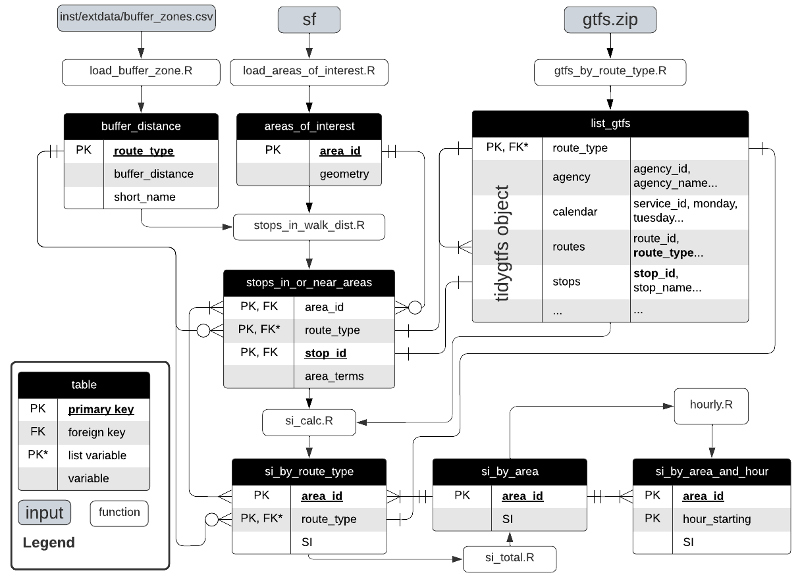
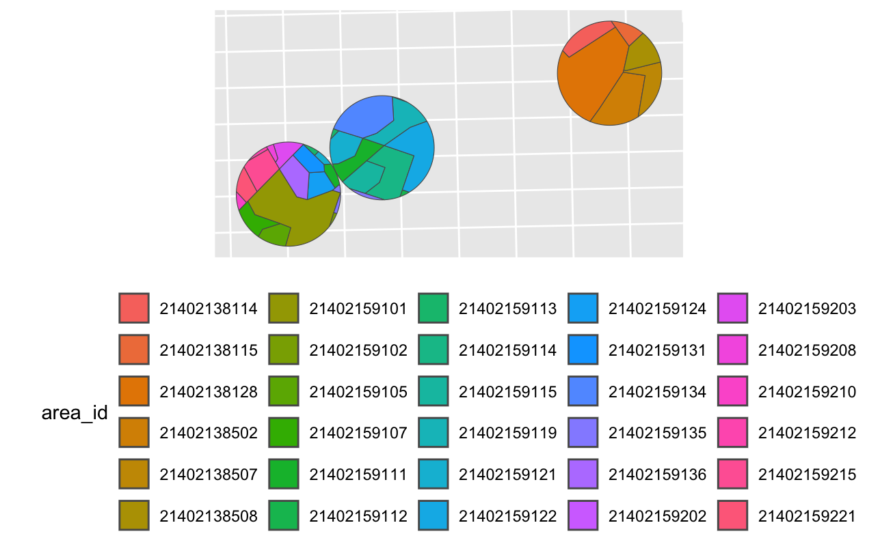

---
title: "Accessibility by and to transit; comparison with transit Supply Index results"
runningheader: "Reynolds (2025)" # only for pdf output
author: "James Reynolds"
date: "`r Sys.Date()`"
output:
  tufte::tufte_handout:
    citation_package: natbib
    latex_engine: xelatex
bibliography: [packages.bib, References.bib]
link-citations: yes
header-includes:
  - \usepackage{titling}
  - \pretitle{\begin{center}
    \includegraphics[width=2in,height=2in]{ptrg-logo-s.png}\LARGE\\}
  - \posttitle{\end{center}}

---

```{r setup, include=FALSE}
library(tufte)
library(tidyverse)
library(tidytransit)
library(sp)
library(strayr)
library(ptinpoly)
library(magrittr)
library(ggplot2)
library(sf)
library(ASGS.foyer)
library(raster)
library(ggmap)
library(units)
library(janitor)
library(mapview)
library(ggstatsplot)
library(gtsummary)
library(moments)
library(scales)
library(gtfstools)
library(lubridate)
library(kableExtra)
library(knitr)
library(readxl)
library(dplyr)
library(devtools)
library(gtfssupplyindex)

# invalidate cache when the tufte version changes
#knitr::opts_chunk$set(cache.extra = packageVersion('tufte'))
```

# Introduction
@currie2007identifying and @currie2010identifying 
previously developed a 
transit Supply Index (SI) 
to compare public transport 
frequency and coverage between 
across geographic areas (such as census districts). 
Code to calculate SI scores 
from GTFS datasets was recently developed 
as an R package^[See @Reynolds:2025aa and https://github.com/James-Reynolds/gtfssupplyindex], 
with SI scores^[For SA1s accross all of Victoria for the week starting 27/04/23] 
also provided as an input to a forthcoming paper on how transit service levels impact housing prices^[@liang5144567exploring]. 

The SI provides a combined measure 
of both accessibility 'by transit' 
and 'to transit' by including 
service frequency and service coverage in the calculations. 
However, the extent to which 'by transit' 
or 'to transit' 
might influence housing prices 
is unclear, 
as the @liang5144567exploring 
modeling included only the (combined) SI score. 
To further explore and compare how 
housing prices might be influenced 
by transit accessibility (both 'by' and 'to' transit) 
a set of corresponding scores need to be calculated.  

This note describes the development of these 
'by' and 'to' transit scores, 
as a follow up to the SI scores 
previously provided.  
The rest of this document 
is structured as follows: 
the next section outlines the context of the SI. 
Methods used to develop the ''by' and 'to' transit accessibility 
metrics are then described, 
followed by presentation of results for SA1s in Victoria. 
The results, including differences to the SI scores 
are then discussed.  


# Research context: the Suppy Index

```{marginfigure}
\begin{equation}
  SI_{area, time} = \sum{\frac{Area_{Bn}}{Area_{area}}*SL_{n, time}}
  \end{equation}
```

The Supply Index (SI) equation 
is shown in the margin figure^[
Minor adjustments have been made 
to generalise the equation, 
as Currie and Senbergs (2007) focus 
was the context of Melbourne's Census Collection Districts (CCD) 
and calculations based on a week of transit service. 
CCDs predate the introduction of 
Statistical Areas 1, 2, 3, and 4 (SA1, SA2, SA3, SA4), 
and other geographical divisions 
currently used by the Australian Bureau of Statistics (ABS), 
which may be more familiar to readers.], 
in which:
(1) $SI_{area, time}$ is the Supply Index for the area of interest 
and a given period of time;
(2) $Area_{Bn}$ is the buffer area for each stop (n) within the area of interest. 
In Currie and Senbergs (2007) this was based on 
a radius of 400 metres for bus and tram stops, 
and 800 metres for railway stations;
(3) $Area_{area}$ is the area of the area of interest; and
(4) $SL_{n,time}$ is the number of transit arrivals for each stop 
for a given time period.


# Methodology
The SI equation lends itself to a simple separation 
into coverage and frequency components, 
as per equations 2 and 3. 
For coverage, this is a measure 
of how much of 
each area of interest is 
within the buffer areas of nearby transit stops. 
However, as the buffer areas of nearby stops 
might overlap it is possible to have 
a coverage value that is larger than 100\%. 


```{marginfigure}
\begin{equation}
  Coverage_{area} = \sum{\frac{Area_{Bn}}{Area_{area}}}
  \end{equation}
```


The frequency measure 
is a summation of the number of transit arrivals (for the given time period)
at stops where there is 
some overlap of the stop buffer area with the area of interest. 


```{marginfigure}
\begin{equation}
  Frequency_{area, time} = \sum{SL_{n, time}} \text{for} \frac{Area_{Bn}}{Area_{area}} > 0 
  \end{equation}


```

## Coverage calculation
As shown in Figure 1, the gtfssupplyindex consists of a number of R functions that perform parts of the SI calculation, starting with: a definition of the buffer distances to be used, a shape file (defining the areas of interest), a gtfs file. These are variously transformed into different tables (e.g. buffer_distance, areas_of_interest, list_gtfs etc.), culminating in the si_by_area table that produces a SI score for each area of interest (or the si_by_area_and_hour table that produces SI scores for each area of intersect for each hour of the day) 

```{r echo=FALSE, out.width='100%', fig.cap = "gtfssupplyindex package structure", fig.fullwidth = FALSE}

```

The stops_in_or_near_areas table is key to calculating coverage, as this table details the area_terms for each combination of area_id, route_type and stop_id. Calculation of the $Coverage_{area}$ value for each area will therefore be a matter of adding the area_terms for all combinations of route_type and stop_id that apply to each area of interest (defined by area_id). 

## Frequency calculation

## Mornington Penninsula test data
The gtfssupplyindex package includes a set of test data, sourced from the ABS SA1 (2021) boundaries and the Mornington Penninsula Tourist Railway GTFS feed. This GTFS feed includes only three stations and a small number of trips, and so is useful for testing that code runs as expected, and to hand-verify calculation results.  


## Victoria


# Results

## Mornington Penninsula

The calculated coverages are shown in Table 1, while Figure 2 shows a plot of the parts of the SA1s that are within the buffer areas around each of the stations. 


```{r echo=FALSE, out.width='100%', fig.cap = "Mornington Penninsula SA1 coverage plot", fig.fullwidth = FALSE, fig.keep = "first", echo=FALSE, message=FALSE, warning=FALSE}
#load the revised mornington GTFS data
list_gtfs = gtfssupplyindex:::gtfs_by_route_type(system.file(
"extdata/mornington180109",
"gtfs.zip", 
package = "gtfssupplyindex", 
mustWork = TRUE))

areas_of_interest <- load_areas_of_interest(areas_of_interest = sf::st_read(system.file(
"extdata",
"mornington_sa12021.geojson", 
package = "gtfssupplyindex", 
mustWork = TRUE)), 
area_id_field = "sa1_code_2021")
 
buffer_distance <- gtfssupplyindex:::load_buffer_zones()

mornington_stops_in_or_near_areas <- gtfssupplyindex:::stops_in_walk_dist(
list_gtfs = list_gtfs, 
areas_of_interest = areas_of_interest,
EPSG_for_transform = 28355, 
verbose = FALSE)

# The mornington_areas.png file was generated from having verbose = TRUE, but made a mess of the PDF when done live in the code.  Hence, I just saved an image to get the desired output for comparison purposes. 


## aggregate by area_id
mornington_coverage <- mornington_stops_in_or_near_areas %>% bind_rows(.id="mode")
mornington_coverage <- as.data.frame(xtabs(area_terms ~ area_id, mornington_coverage))
names(mornington_coverage) <- c("area_id", "coverage")  

kable(mornington_coverage, caption = "Mornington Penninsula Tourist Railway coverage by SA1")

```

Results appear consistent with expectations, with most SA1s having only partial coverage.  Three SA1s, however, have 100\% coverage^[21402159134, 21402159131 and 21402159136], matching the three small SA1s^[Dark blue, light blue and purple] within the walking catchment of the south-western-most station. The result for area_id 21402159111 also meets expectations, being the SA1 that is almost, but not quite, completely covered by parts of the south-western and centre-most station buffer areas^[Being 98\% covered, in light green].  


# Discussion and conclusions


# References {#references }


```{r, include=FALSE}
knitr::write_bib(file = 'packages.bib')
```


